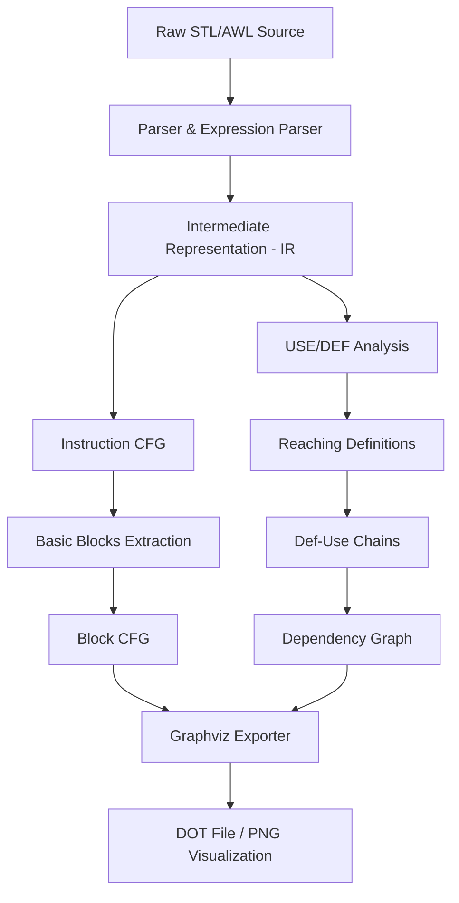

# 🔍 STL Parser & Static Analysis Pipeline

**STL Parser & Static Analysis Pipeline** is a compact Python-based tool designed for parsing STL/AWL-style PLC code (Siemens Instruction List) and building a lightweight static analysis pipeline.

The project translates raw STL instructions into a structured Intermediate Representation (IR), builds control flow graphs (CFG) at both the instruction and basic block levels, performs detailed data-flow analysis to extract clean dependency chains—optimizing the code structure for LLM context ingestion—and exports visual diagrams using Graphviz.


---

## 📐 Architecture & Pipeline Flow

The analysis pipeline processes Siemens STL/AWL files through the following stages:



---

## ✨ Features

### 🧮 Parsing & Intermediate Representation
*   **STL/AWL Parsing:** Parses raw instructions into a typed Intermediate Representation (IR).
*   **Label Resolution:** Automatically resolves jump targets and flags unused labels.
*   **Jump Handling:** Full support for conditional (`JC`) and unconditional (`JU`) jumps.

### 🕸 Control Flow Graphs (CFG)
*   **Instruction-level CFG:** Constructs a fine-grained control flow graph showing transitions between individual instructions.
*   **Basic Block Construction:** Groups linear sequences of instructions that have single-entry and single-exit points.
*   **Block-level CFG:** Builds a high-level flow graph illustrating transitions between basic blocks.

### 🔬 Data-Flow Analysis
*   **USE/DEF Analysis:** Tracks variables and registers read (USE) and modified (DEF) by each instruction.
*   **Reaching Definitions:** Identifies which definitions can reach given points in the code.
*   **Def-Use Chains:** Computes direct chains linking each variable's definition to its subsequent usages.
*   **Dependency Graph:** Exports a final data-dependency graph showing how values flow through instructions.

---

## 🛠 Tech Stack

*   **Language:** Python 3.10+ (pure Python implementation with no heavy external library dependencies).
*   **Testing:** Pytest for running comprehensive test suites to validate parsing correctness and analysis logic.
*   **Visualization:** Graphviz (generates `.dot` graph configurations which can be compiled into PNG/SVG).

---

## 🚀 Quick Start

### 1. Clone & Navigate
```bash
git clone <repo-url>
cd STL_PARSER
```

### 2. Run the Test Suite
```bash
python -m pytest -v
```

### 3. Run the Core Demos
Run the main pipeline or export the Graphviz control flow graph:
```bash
# View full pipeline output in console
python -m tools.show_pipeline

# Generate CFG and export to Graphviz
python -m tools.export_graph
dot -Tpng cfg.dot -o cfg.png
```

---

## 🔧 CLI Utilities & Demos

The `tools/` folder contains several utility scripts for debugging, analyzing, and demonstrating different parts of the project:

*   **`python -m tools.show_pipeline`**: Runs the complete parser and analysis pipeline on a sample STL block, printing all IR, CFG, USE/DEF, and reaching definition maps to the console.
*   **`python -m tools.export_graph`**: Compiles an STL snippet and generates a `.dot` file of the CFG for visualization with Graphviz.
*   **`python -m tools.analyze_project`**: Runs high-level statistics on the stress-test STL code, listing total instructions, labels, warnings, and opcode frequencies.
*   **`python -m tools.show_cfg`**: Prints basic blocks and their control-flow connections.
*   **`python -m tools.show_dataflow`**: Computes and prints the USE/DEF sets for each parsed statement.
*   **`python -m tools.show_reaching`**: Demonstrates the reaching definitions data-flow algorithm step-by-step.
*   **`python -m tools.debug_warnings`**: Scans files and prints syntactic or reference warnings (e.g., unresolved jumps).
*   **`python -m tools.generate_stress_stl`**: A script to generate arbitrarily large synthetic STL listings for stress-testing.

---

## 📂 Project Structure

*   `analysis/` — Core static analysis modules (basic blocks, CFGs, USE/DEF maps, reaching definitions, and pipeline orchestration).
*   `tools/` — CLI utilities and helper scripts for running the analysis pipeline, visualizers, debuggers, and test-data generators.
*   `exporters/` — Exporters and visualizers (e.g., Graphviz exporter).
*   `tests/` — Module tests for validating the parsers and static analysis logic.
*   `data/` — Example STL/AWL files for testing.
*   `parser.py` — Lexer and syntax parser for instructions.
*   `expression_parser.py` — Helper parser for operands and complex expressions.

---

## 💡 Example Usage

### Input STL Code:
```awl
L MW10
JC END

T MW20

END:
L MW20
= Q0.0
```

### Pipeline Output Includes:
1.  **Parsed Instructions:** Tokenized instructions with resolved operands.
2.  **Instruction CFG:** Branch and flow edges between individual lines.
3.  **Basic Blocks:** Linear block partition segments.
4.  **Block CFG:** High-level transitions between blocks.
5.  **Use/Def Information:** Variables read and modified at each step.
6.  **Reaching Definitions & Def-Use Chains:** Value propagation maps.
7.  **Dependency Graph:** Data dependencies among instructions.

---

## 📝 Supported Syntax

### Instructions:
*   `L` — Load into accumulator.
*   `T` — Transfer from accumulator.
*   `A` / `AN` — Logical AND / AND NOT.
*   `O` / `ON` — Logical OR / OR NOT.
*   `S` / `R` — Set / Reset bit.
*   `JU` / `JC` — Unconditional / Conditional Jump.
*   `=` — Assign.

### Additional Features:
*   Labels and label-only lines.
*   Single-line comments starting with `//`.
*   Unresolved jump warnings.

---

## 🗺 Roadmap

### 🤖 LLM & Context Optimization
*   [ ] **LLM-ready JSON context exporter:** Optimized semantic tokens and dependency mappings for prompt injection.
*   [ ] **Symbolic tracking of RLO (Result of Logic Operation):** Reconstructing complex boolean logic expressions for cleaner translation.
*   [ ] **SCL (Structured Control Language) parser support:** Extending static analysis to higher-level structured Siemens code.

### 🔌 PLC Integration
*   [ ] **Hardware Configuration Mapping:** Resolving memory registers and registers mapping to physical I/O symbols.
*   [ ] **Siemens S7-STL Instructions:** Extending support for complex and specific instruction semantics.

### 🔬 Advanced Compiler/Analysis Representations
*   [ ] SSA (Static Single Assignment) form conversion.
*   [ ] Control Dependence Graph (CDG) & Program Dependence Graph (PDG) exports.
*   [ ] Support for additional visualization formats.

---

## 🤝 License

Distributed under the MIT License. See [LICENSE](file:///d:/stl_parser/LICENSE) for more information.

---

> **STL Parser & Static Analysis Pipeline** — analyze the structure and dependencies of your PLC code with ease! 💡

